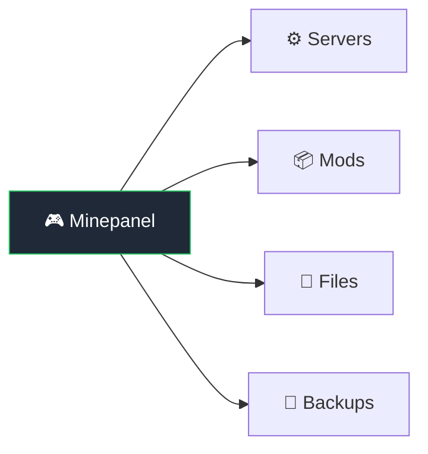

# Features

## Server Management

| Feature          | Description                                                          |
| ---------------- | -------------------------------------------------------------------- |
| Java & Bedrock   | Both Minecraft editions supported                                    |
| Multiple servers | Run as many as hardware allows, isolated containers                  |
| All server types | Vanilla, Paper, Forge, Neoforge, Fabric, Purpur, GTNH, CurseForge and Modrinth modpacks |
| Any version      | 1.8 to latest, snapshots included                                    |
| Templates        | Pre-configured: Survival, Creative, SkyBlock, PvP, Bedrock presets, and Paper cross-play |
| Java defaults    | Global defaults for new Java servers (offline mode, resources, backup switch) |
| Resource limits  | Set RAM, CPU per server                                              |

## Real-time Monitoring

| Feature   | Description                               |
| --------- | ----------------------------------------- |
| Dashboard | Status cards, resource usage at a glance  |
| Live logs | Streaming, errors highlighted, searchable |
| Stats     | CPU%, RAM%, player count, uptime          |

## Server Control

| Feature        | Description                                               |
| -------------- | --------------------------------------------------------- |
| Basic controls | Start, Stop, Restart, Delete                              |
| Console        | RCON (Java) or send-command (Bedrock)                     |
| Quick actions  | Save world, toggle whitelist, set time/weather, broadcast |

## Roles and Access Control

This is the first phase of Minepanel roles.

| Feature | Description |
| ------- | ----------- |
| `ADMIN` role | Full panel access without permission restrictions |
| `USER` role | Access limited by explicit permissions |
| `manageUsers` permission | Lets delegated operators manage users, invitations, and audit access without full admin rights |
| Server access | All servers or selected server assignments |
| Logs vs console | Separate permissions for viewing logs and sending commands |
| File access | Separate permissions for global files and per-server files |
| Invitations | New users join through invitation links, with optional SMTP delivery |
| Audit log | Filterable activity history for account, invitation, and server actions |

### Authorization model

- The frontend can hide or show sections for convenience, but the backend is the real permission boundary.
- Minepanel keeps authentication in `httpOnly` cookies and does not rely on `localStorage` for authorization.
- The current user/session can be cached briefly **in memory only** to reduce repeated calls such as `/auth/me` or `/users/one`.
- Every protected backend route still resolves the current user and re-checks the required permission before returning data or executing the action.

### Audit coverage

The current audit phase includes:

- login
- invitation creation, copy, and acceptance
- password changes
- email change request and confirmation
- user access updates and deletion
- server configuration saves
- server start, stop, and restart
- console command execution

## Player Management

| Feature        | Description                                |
| -------------- | ------------------------------------------ |
| Online players | View, kick, ban, change gamemode, teleport |
| Whitelist      | Add/remove players                         |
| Operators      | Manage OPs from panel                      |
| Ban list       | View reasons, unban                        |

## Mod & Plugin Support

| Feature    | Description                          |
| ---------- | ------------------------------------ |
| Modrinth   | Auto-download, dependency resolution |
| CurseForge | Mods and modpacks                    |
| Combined   | Use both simultaneously              |
| In-panel search | Search and add mod slugs/IDs directly from the Mods tab |
| Cross-play template | One-click Paper preset with Geyser, Floodgate, ViaVersion, and UDP port 19132 |

**→ Details:** [Mods & Plugins](/mods-plugins)

## File Management

Built-in browser for each server under `servers/<id>/mc-data`:

- Upload/download files
- Edit configs (syntax highlighting)
- Create/delete/rename
- Drag & drop support

Common paths:

- Worlds source library for world switching: `servers/<id>/worlds/`
- Shared World Library for all servers: `servers/.world/worlds/`
- Active level data: `mc-data/<LEVEL>/`
- Java mods: `mc-data/mods/`
- Java plugins (Paper/Spigot/Purpur/etc): `mc-data/plugins/`
- Core config files: `mc-data/server.properties`, `mc-data/eula.txt`

Operational notes:

- Uploading/changing worlds, mods, plugins, and most configs usually requires restart.
- World switching supports folders with `level.dat` and archives (`.zip`, `.tar`, `.tar.gz`, `.tgz`).
- `WORLD` clone source is mounted read-only by Minepanel to avoid accidental source overwrites.
- World Library includes **Discover Worlds** to search CurseForge worlds and import remote ZIP/TAR URLs directly into `servers/.world/worlds/`.

## Backups

| Feature   | Description           |
| --------- | --------------------- |
| Automatic | Schedule daily/weekly |
| Manual    | One-click backup      |
| Restore   | Select and restore    |
| Download  | Get backup files      |

Backup configuration is available in **Advanced -> Backup** (Java servers):

- `backupMethod`: `tar`, `rsync`, `restic`, `rclone`
- `backupInterval`, `backupInitialDelay`
- `backupPruneDays`, `backupDestDir`, `backupExcludes`
- `backupOnStartup`

Practical defaults:

- `backupMethod=tar`
- `backupInterval=24h`
- `backupPruneDays=7`
- `backupDestDir=/backups`

If you only need local compressed backups, start with `tar`. Use `restic` or `rclone` only when you already have remote storage configured.

## Configuration

Edit from UI:

- Server name, MOTD
- Max players, difficulty, game mode
- View distance, PVP, command blocks
- JVM arguments, extra flags

## Server Resources (Java)

In **Resources** tab:

- **Memory/CPU:** set `INIT_MEMORY`, `MAX_MEMORY`, and CPU limits per server
- **JVM Options:** use `JVM_OPTS`, `JVM_XX_OPTS`, `JVM_DD_OPTS`, `EXTRA_ARGS`
- **Advanced Runtime:** timezone, auto-stop, auto-pause, rolling logs

Recommended approach:

1. Set only `INIT_MEMORY` and `MAX_MEMORY` first.
2. Enable Aikar flags if you do not have a custom JVM tuning profile.
3. Change `JVM_XX_OPTS` only when you have measured a performance issue.

## Other

| Feature          | Description                               |
| ---------------- | ----------------------------------------- |
| Multi-language   | EN, ES, NL, DE, PL                        |
| Multi-arch       | x86_64, ARM64 (Pi, Apple Silicon)         |
| Discord webhooks | Server event notifications                |
| MC Proxy Router  | Single port for Java servers via hostname |

## Edition Comparison

| Feature       | Java Edition                | Bedrock Edition         |
| ------------- | --------------------------- | ----------------------- |
| Server Types  | Vanilla, Paper, Forge, etc. | Vanilla only            |
| Default Port  | 25565 (TCP)                 | 19132 (UDP)             |
| Commands      | RCON console                | send-command (via logs) |
| Proxy Support | Yes (mc-router)             | No                      |
| Mods/Plugins  | Full support                | Addons/Behavior Packs   |
| Backups       | Full support                | Full support            |

::: tip Bedrock Commands
Bedrock servers use `send-command` instead of RCON. Command output appears in server logs rather than returning directly.
:::

## Coming Soon

- Export logs from the log viewer
- Dedicated `server.properties` editor with validation
- Scheduled tasks (auto restart, commands)
- Plugin browser

**→ Full roadmap:** [Roadmap](/roadmap)
