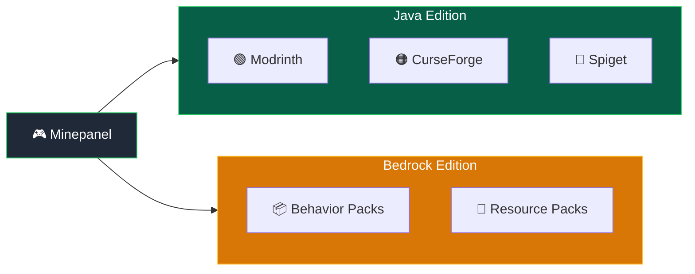

# Mods, Plugins & Addons

Manage mods for Java Edition and addons for Bedrock Edition from the same Minepanel workflow.


## Overview

| Edition     | Platforms / Sources                    | Automation                                  |
| ----------- | -------------------------------------- | ------------------------------------------- |
| **Java**    | Modrinth, CurseForge, Spiget           | ✅ Automatic                                |
| **Bedrock** | Upload `.mcaddon` / `.mcpack` / `.zip`, CurseForge | ✅ Import, enable/disable, sync to world |



---

## Java Edition Platforms

| Platform       | Best For                 | API Key Required |
| -------------- | ------------------------ | ---------------- |
| **Modrinth**   | Mods, datapacks, plugins | ❌ No            |
| **CurseForge** | Modpacks, mods           | ✅ Yes           |
| **Spiget**     | Spigot/Paper plugins     | ❌ No            |

::: tip Learn More
For advanced options and all environment variables, see the [docker-minecraft-server mods documentation](https://docker-minecraft-server.readthedocs.io/en/latest/mods-and-plugins/).
:::

### Paper Cross-Play Template

If you want a Java server that also accepts Bedrock players, Minepanel now includes a **Paper Cross-Play** template in **Create Server -> From Template**.

It preconfigures:

- `Geyser`
- `Floodgate`
- `ViaVersion`
- `19132:19132/udp` as an extra port for Bedrock connections

This is a preset for faster setup. You can still edit the plugin URLs or extra ports later from the server configuration tabs.

## Integrated Mod Search in Minepanel

Minepanel includes an integrated search dialog in the **Mods** tab for both **CurseForge Files** and **Modrinth Projects**.

### What it does

- Searches directly from Minepanel (no need to manually browse first)
- Filters results by current server compatibility:
  - Minecraft version
  - Loader (Forge/Neoforge/Fabric/Quilt) when available
- Adds entries in one click as:
  - **Slug** (default)
  - **ID**

### How to use it

1. Open **Create Server** or **Edit Server**
2. Go to the **Mods** tab
3. In either **CurseForge Files** or **Modrinth Projects**, click **Search mods**
4. Pick insertion format (Slug or ID)
5. Click **Add mod**

The selected entries are appended to the same existing fields (`CURSEFORGE_FILES` and `MODRINTH_PROJECTS`) using newline format, preserving manual entries and avoiding duplicates.

---

## Modrinth

Automatically download and manage mods, plugins, and datapacks from [Modrinth](https://modrinth.com).

### Supported Server Types

- ✅ Fabric
- ✅ Forge
- ✅ Neoforge
- ✅ CurseForge (AUTO_CURSEFORGE)
- ✅ Modrinth Modpacks

### How to Add Mods from Minepanel

1. Go to **Create Server** or **Edit Server**
2. Open the **Mods** tab
3. Find the **Modrinth Projects** field (blue border)
4. Enter project slugs separated by commas or new lines
5. Configure dependencies and version type if needed
6. Save the server

**Example input:**

```
fabric-api
sodium
lithium
cloth-config
```

### Datapacks from Modrinth {#datapacks}

Modrinth also hosts datapacks. To install them, use the `datapack:` prefix:

**In Minepanel (Modrinth Projects field):**

```
fabric-api
sodium
datapack:terralith
datapack:incendium
datapack:nullscape:1.2.4
```

**Syntax:**

| Format                  | Example                    | Description      |
| ----------------------- | -------------------------- | ---------------- |
| `datapack:slug`         | `datapack:terralith`       | Latest version   |
| `datapack:slug:version` | `datapack:terralith:2.5.5` | Specific version |
| `datapack:slug:beta`    | `datapack:terralith:beta`  | Latest beta      |

::: tip Vanilla Servers
For vanilla servers, the `datapack:` prefix is optional. The system auto-detects datapacks.
:::

::: warning
Datapacks require a compatible Minecraft version. Check the datapack page on Modrinth for compatibility.
:::

### Project Reference Formats

The **Modrinth Projects** field accepts multiple formats:

| Format              | Example                     | Description       |
| ------------------- | --------------------------- | ----------------- |
| Slug                | `fabric-api`                | Latest release    |
| Slug + version      | `fabric-api:0.119.2+1.21.4` | Specific version  |
| Slug + version ID   | `fabric-api:bQZpGIz0`       | By version ID     |
| Slug + release type | `fabric-api:beta`           | Latest beta/alpha |
| Project ID          | `P7dR8mSH`                  | Using Modrinth ID |
| Loader override     | `fabric:fabric-api`         | Force loader type |
| Datapack            | `datapack:terralith`        | Install datapack  |

### Configuration Options

| Field                 | Description                       | Default   |
| --------------------- | --------------------------------- | --------- |
| **Modrinth Projects** | List of mods/plugins/datapacks    | -         |
| **Dependencies**      | `none`, `required`, or `optional` | `none`    |
| **Version Type**      | `release`, `beta`, or `alpha`     | `release` |

::: tip Auto-Removal
Mods removed from the list will be automatically deleted on next server start.
:::

### Docker Compose Reference

If you prefer to configure via docker-compose directly:

```yaml
environment:
  TYPE: FABRIC
  VERSION: 1.21.4
  MODRINTH_PROJECTS: |
    fabric-api
    sodium
    datapack:terralith
  MODRINTH_DOWNLOAD_DEPENDENCIES: required
  MODRINTH_PROJECTS_DEFAULT_VERSION_TYPE: release
```

<details>
<summary>More docker-compose examples</summary>

**Forge server with specific versions:**

```yaml
environment:
  TYPE: FORGE
  VERSION: 1.20.1
  MODRINTH_PROJECTS: |
    jei:10.2.1.1005
    geckolib
    create
```

**Using a listing file:**

Create `/path/to/mods.txt`:

```
# Performance mods
fabric-api
sodium
lithium

# Datapacks
datapack:terralith
datapack:incendium
```

Then mount and reference:

```yaml
volumes:
  - ./mods-list:/extras:ro
environment:
  MODRINTH_PROJECTS: '@/extras/mods.txt'
```

</details>

## Modrinth Modpacks {#modrinth-modpacks}

Install complete modpacks from [Modrinth](https://modrinth.com) using the **MODRINTH_MODPACK** server type.

### Installation Methods in Minepanel

When creating/editing a server with type **MODRINTH_MODPACK**, there is one method which can be used in several ways.

| Method                | Auto-updates? | Use case                                  |
| --------------------- | ------------- | ----------------------------------------- |
| **Slug**              | ✅ Yes         | Always gets the latest compatible version |
| **URL**               | ✅ Yes         | Always gets the latest compatible version |
| **URL with verison**  | ✅ No          | Locks to the specified version            |

**Slug**

1. Enter the modpack project slug (e.g., `surface-living`) into the Modrinth Modpack field
3. On each server start, it downloads the **latest compatible version**

**Url**

1. Enter the modpack project URL (e.g., `https://modrinth.com/modpack/surface-living`)
2. On each server start, it downloads the **latest compatible version**

**Url (version locked)**

1. Enter the modpack project URL for a specific version (e.g., `https://modrinth.com/modpack/surface-living/version/1.2.1`)
2. On each server start, it will **ignore any updated version** of the modpack

## CurseForge Modpacks {#curseforge-modpacks}

Install complete modpacks from [CurseForge](https://www.curseforge.com) using the **AUTO_CURSEFORGE** server type.

::: warning API Key Required
You need a CurseForge API key. Get one from [CurseForge for Studios](https://console.curseforge.com/).
:::

### Installation Methods in Minepanel

When creating/editing a server with type **AUTO_CURSEFORGE**, you can choose between 3 methods:

| Method   | Auto-updates? | Use case                                 |
| -------- | ------------- | ---------------------------------------- |
| **URL**  | ✅ Yes         | Always get the latest compatible version |
| **Slug** | ❌ No          | Lock to a specific file version          |
| **File** | ❌ No          | Use a local modpack zip file             |

### Method: URL (Recommended for auto-updates)

1. Select **URL** as installation method
2. Paste the modpack page URL from CurseForge
3. On each server start, it downloads the **latest compatible version**

**Example URL:**

```
https://www.curseforge.com/minecraft/modpacks/all-the-mods-9
```

::: tip
Use URL method if you want automatic updates when the modpack releases new versions.
:::

### Method: Slug (Lock specific version)

1. Select **Slug** as installation method
2. Enter the modpack slug (e.g., `all-the-mods-9`)
3. Enter the **File ID** for the specific version you want

**How to find the File ID:**

1. Go to the modpack page on CurseForge
2. Click on "Files" tab
3. Click on the version you want
4. The File ID is in the URL: `.../files/5765432` → File ID is `5765432`

::: warning
With Slug method, the version **never updates automatically**. You must manually change the File ID to update.
:::

### Method: File (Local modpack)

1. Select **File** as installation method
2. Upload/mount your modpack zip to the server
3. Enter the file pattern (e.g., `*.zip`)

Useful for modpacks downloaded manually or custom modpacks.

### World source conflict with Worlds tab

For `AUTO_CURSEFORGE`, `CF_SET_LEVEL_FROM` and the Java **Worlds** tab are alternative world-source mechanisms.

- If you use the **Worlds** tab (`WORLD`/`LEVEL`), Minepanel clears `CF_SET_LEVEL_FROM`.
- If you need modpack-provided world data (`WORLD_FILE` or `OVERRIDES`), keep using `CF_SET_LEVEL_FROM` and do not select an external world source.

### Browse Modpacks

Minepanel includes a **Browse** button to search CurseForge modpacks directly from the UI. Click it to find and select modpacks without leaving the panel.

## GTNH {#gtnh}

Minepanel also supports **GT New Horizons** through the dedicated **GTNH** server type.

Use it when you want the container to handle GTNH-specific install and update behavior without manually entering env vars.

Available GTNH fields in Minepanel:

- `GTNH_PACK_VERSION`
- `GTNH_DELETE_BACKUPS`
- `SKIP_GTNH_UPDATE_CHECK`

Recommended workflow:

1. Keep a fixed pack version such as `2.8.1`
2. Leave update check enabled for the first install
3. Only enable `SKIP_GTNH_UPDATE_CHECK` after the server has been installed once

## CurseForge Files (Individual Mods) {#curseforge-files}

Download specific mods/plugins from [CurseForge](https://www.curseforge.com) to add to any modded server.

::: warning API Key Required
Same API key as modpacks. Get one from [CurseForge for Studios](https://console.curseforge.com/).
:::

### How to Add Mods from Minepanel

1. Go to **Create Server** or **Edit Server** (Forge, Fabric, or AUTO_CURSEFORGE)
2. Open the **Mods** tab
3. Find the **CurseForge Files** field (green border)
4. Enter mod slugs separated by commas or new lines
5. Save the server

**Example input:**

```
jei
geckolib
aquaculture
```

### Reference Formats

| Format         | Example                          | Description               |
| -------------- | -------------------------------- | ------------------------- |
| Slug           | `jei`                            | Latest compatible version |
| Slug + File ID | `jei:4593548`                    | Specific version          |
| Slug + version | `jei@10.2.1.1005`                | By partial filename       |
| Project ID     | `238222`                         | Using CurseForge ID       |
| URL            | `https://curseforge.com/.../jei` | From page URL             |

::: tip Auto-Selection
Without a File ID, the newest compatible file for your Minecraft version is selected automatically.
:::

### Docker Compose Reference

<details>
<summary>Docker-compose examples</summary>

**Basic mod list:**

```yaml
environment:
  CF_API_KEY: $2a$10$Iao...
  CURSEFORGE_FILES: |
    jei
    geckolib
    aquaculture
```

**Specific versions:**

```yaml
environment:
  CURSEFORGE_FILES: |
    jei:4593548
    geckolib@4.2.1
```

**Using listing file:**

```yaml
volumes:
  - ./cf-list:/extras:ro
environment:
  CURSEFORGE_FILES: '@/extras/cf-mods.txt'
```

</details>

## Combining Modrinth and CurseForge

You can use both Modrinth and CurseForge Files together:

```yaml
environment:
  TYPE: FABRIC
  VERSION: 1.21.4

  # Modrinth mods (preferred for performance)
  MODRINTH_PROJECTS: |
    fabric-api
    sodium
    lithium
  MODRINTH_DOWNLOAD_DEPENDENCIES: required
  # CurseForge exclusive mods
  CF_API_KEY: your_key
  CURSEFORGE_FILES: |
    some-cf-exclusive-mod
    another-cf-mod
```

::: warning Version Compatibility
Always ensure mods from both sources are compatible with your Minecraft version and loader type.
:::

## Plugin Management (Spigot/Paper/etc)

For plugin-based servers (Spigot, Paper, Bukkit, etc.), you can use Spiget:

```yaml
environment:
  TYPE: PAPER
  VERSION: 1.21.4
  SPIGET_RESOURCES: |
    9089
    28140
    34315
```

Where the numbers are Spigot resource IDs from [SpigotMC](https://www.spigotmc.org/resources/).

## Bedrock Addons

Bedrock Edition uses **behavior packs** and **resource packs** instead of traditional mods.

Minepanel now includes an **Addons** tab for Bedrock servers with two sources:

- **Manual upload** of `.mcaddon`, `.mcpack`, or `.zip`
- **CurseForge import** using your configured API key

Downloaded addon files are stored under `servers/<server-id>/addons/` and Minepanel syncs enabled packs into `mc-data/behavior_packs/` and `mc-data/resource_packs/`.

When you enable an addon, Minepanel also updates:

- `worlds/<level-name>/world_behavior_packs.json`
- `worlds/<level-name>/world_resource_packs.json`

### Understanding Bedrock Addons

| Type          | Extension  | Purpose                 | Client Download |
| ------------- | ---------- | ----------------------- | --------------- |
| Behavior Pack | `.mcaddon` | Changes game mechanics  | No              |
| Resource Pack | `.mcpack`  | Changes textures/sounds | Yes (prompted)  |

Both `.mcaddon` and `.mcpack` files are actually **renamed ZIP files**.

::: info Resource Pack vs Behavior Pack
Many Bedrock projects publish the **resource pack (RP)** and **behavior pack (BP)** as separate downloads.

- If you import only the **RP**, Minepanel can activate it, but gameplay logic will not exist.
- If the addon changes mechanics, entities, scripts, UI interactions, or world logic, you usually also need the **BP** companion.
- The Addons tab shows which packs were detected for each import (`RP`, `BP`, or both).
:::

### Installation Steps

#### 1. Open the Addons Tab

Go to your Bedrock server and open **Addons**.

#### 2. Choose a Source

You can:

- Upload a local `.mcaddon`, `.mcpack`, or `.zip` file
- Search CurseForge and import directly from the UI

If you use CurseForge, configure your API key first in **Settings**.

#### 3. Enable the Addon

Imported addons are stored first, then you can enable or disable each one from the list.

When enabled, Minepanel:

- Extracts and registers pack metadata from each `manifest.json`
- Copies behavior packs into `mc-data/behavior_packs/<uuid>/`
- Copies resource packs into `mc-data/resource_packs/<uuid>/`
- Rebuilds the world pack JSON files for the active Bedrock world

#### 4. Restart the Server

Restart the server to apply the enabled addons.

If you want clients to be forced to download enabled **resource packs**, also enable `TEXTUREPACK_REQUIRED` or set it from the **Bedrock** settings tab.

#### 5. Force Resource Packs (Optional)

To require clients to download resource packs:

```yaml
environment:
  TEXTUREPACK_REQUIRED: 'true'
```

Or set it in Minepanel's **Bedrock** settings tab.

Players will be prompted to download resource packs when connecting.

### Example: Installing One Player Sleep

1. Open the server's **Addons** tab
2. Upload `ops.mcaddon` or import it from a supported source
3. Wait for Minepanel to detect the contained behavior/resource packs
4. Click **Enable** on the addon
5. Restart the server

### Troubleshooting Bedrock Addons

| Issue                         | Solution |
| ----------------------------- | -------- |
| `Pack Stack - None` in Bedrock logs | Check `world_behavior_packs.json` / `world_resource_packs.json` in the active world and restart after enabling addons |
| Addon appears enabled but has no gameplay effect | Verify you imported the **BP** companion and not only the RP |
| Version error                 | Verify the addon contains a valid `manifest.json` |
| Resource pack not downloading | Set `TEXTUREPACK_REQUIRED: "true"` |
| Pack conflicts                | Check for duplicate UUIDs |
| Server data was cleared       | Minepanel keeps downloaded addon files, but applied runtime packs are reset. Re-enable the addons you want to use again |

### Notes About Server Data Reset

If you use **Clear server data** in Minepanel:

- `mc-data/` is recreated from scratch
- downloaded addon archives remain in `servers/<server-id>/addons/`
- previously applied Bedrock addons are marked as inactive to avoid a broken "enabled but not applied" state

After a reset, go back to **Addons** and enable the packs you want to apply again.

---

## Best Practices (Java Edition)

1. **Use Modrinth when possible** - Generally faster and more reliable
2. **Specify versions** for production servers to avoid unexpected updates
3. **Test in development** before applying to production
4. **Keep API keys secure** - Use environment variables, never commit them
5. **Use listing files** for easier management of large mod lists
6. **Document your mods** - Add comments in listing files to explain what each mod does

## Troubleshooting

### Mods not downloading

- Check API key is correct
- Verify project slugs/IDs are correct
- Check server logs for specific errors
- Ensure network connectivity

### Version conflicts

- Make sure all mods are compatible with your Minecraft version
- Check mod loader compatibility (Fabric vs Forge)
- Review dependency requirements

### Missing dependencies

- For Modrinth: Set `MODRINTH_DOWNLOAD_DEPENDENCIES: required`
- For CurseForge: Manually add dependencies to your list

## Next Steps

- Learn about [Server Types](/server-types)
- See all [Configuration Options](/configuration)
