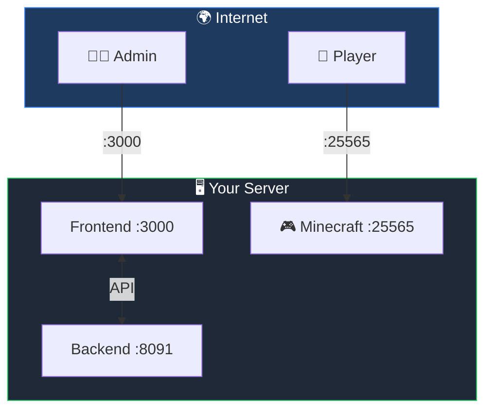
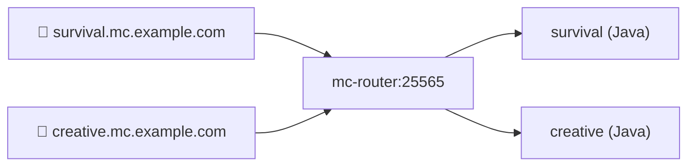

# Networking


## Overview



## Remote Access

<TerminalCommand
  title="remote-access"
  command="docker compose restart"
  :outputs="[
    'Restarting minepanel-frontend ... done',
    'Restarting minepanel-backend  ... done',
    'Minepanel is now available at your LAN IP'
  ]"
/>

Update `docker-compose.yml`:

```yaml
environment:
  - FRONTEND_URL=http://your-ip:3000
  - NEXT_PUBLIC_BACKEND_URL=http://your-ip:8091
```

```bash
docker compose restart
```

## Network Settings (UI)

Configure IPs in **Settings → Network Settings**:

| Setting            | Use                                     |
| ------------------ | --------------------------------------- |
| Public IP / Domain | Discord notifications, external players |
| LAN IP             | Local network players                   |

**Find your LAN IP:**

```bash
# Mac
ipconfig getifaddr en0

# Linux
hostname -I | awk '{print $1}'

# Windows
(Get-NetIPAddress -AddressFamily IPv4 -InterfaceAlias "Ethernet").IPAddress
```

## Connectivity Tab (per server)

Minepanel server configuration includes **General -> Connectivity**.

Key fields:

| Field | What it affects |
| --- | --- |
| `serverPort` | Published game port (`25565` Java, `19132` Bedrock by default) |
| `onlineMode` | Mojang auth verification for Java servers |
| `preventProxyConnections` | Blocks bypass connections when using Java proxy routing |
| `ops` | Operator usernames |
| `opPermissionLevel` | Java op permission level (1-4) |

Notes:

- If Java proxy is enabled globally, port mapping may be controlled by proxy mode.
- Bedrock uses UDP and does not use Java proxy routing.

## Ports

| Service        | Default | Protocol | Description         |
| -------------- | ------- | -------- | ------------------- |
| Frontend       | 3000    | TCP      | Web UI              |
| Backend        | 8091    | TCP      | API                 |
| Java Servers   | 25565+  | TCP      | Java Edition games  |
| Bedrock Servers| 19132+  | UDP      | Bedrock Edition games |

::: warning Bedrock UDP
Bedrock uses UDP, not TCP. Make sure your firewall rules specify the correct protocol.
:::

**Open firewall:**

```bash
# Minepanel
sudo ufw allow 3000/tcp
sudo ufw allow 8091/tcp

# Java servers
sudo ufw allow 25565/tcp

# Bedrock servers
sudo ufw allow 19132/udp
```

## SSL/HTTPS

<NetworkPulseFlow />

### Nginx + Let's Encrypt

```nginx
# /etc/nginx/sites-available/minepanel
server {
    listen 80;
    server_name minepanel.yourdomain.com;

    location / {
        proxy_pass http://localhost:3000;
        proxy_http_version 1.1;
        proxy_set_header Upgrade $http_upgrade;
        proxy_set_header Connection 'upgrade';
        proxy_set_header Host $host;
    }
}
```

```bash
sudo certbot --nginx -d minepanel.yourdomain.com
```

Update environment:

```yaml
- FRONTEND_URL=https://minepanel.yourdomain.com
- NEXT_PUBLIC_BACKEND_URL=https://api.yourdomain.com
```

### Caddy (Auto SSL)

```caddyfile
minepanel.yourdomain.com {
    reverse_proxy localhost:3000
}

api.yourdomain.com {
    reverse_proxy localhost:8091
}
```

## MC Proxy Router (Java Only)

Single port (25565) for all Java servers via hostname routing.

::: warning Java Edition Only
mc-router only works with Java Edition (TCP protocol). Bedrock servers use UDP and cannot be proxied this way. Each Bedrock server needs its own port.
:::



### Setup

1. **DNS:** Create wildcard record `*.mc.example.com → your-ip`

2. **Settings:** Configure base domain in **Settings → Proxy Settings**

3. **Start mc-router:**

```bash
docker compose --profile proxy up -d
```

Java servers auto-get hostnames: `{server-id}.mc.example.com`

### Bedrock Connection

Bedrock servers connect directly via IP and port:

```
Server Address: your-ip
Port: 19132 (or assigned port)
```

## UPnP Port Forwarding

Minepanel supports automatic port forwarding on UPnP-enabled routers. When enabled, Minepanel will automatically map the required ports on your router when a Minecraft server starts, and unmap them when the server stops.

### Enabling UPnP
1. Go to **Settings → Integrations**.
2. Toggle **Enable UPnP Port Forwarding** on.
3. The panel will display the status of the connection to the router and your external IP.

### Firewall Configuration (NixOS / Linux)
Because UPnP discovery (SSDP) uses UDP multicast requests, your system firewall must allow incoming UDP reply traffic from your router. If the firewall blocks these replies, you will see a `timeout` error, and the router status will show as offline.

#### For NixOS
Add the following to your `/etc/nixos/configuration.nix` to allow UDP traffic from your router or local subnet:

```nix
networking.firewall.extraCommands = ''
  # Allow all UDP traffic from the local gateway (e.g. 192.168.100.1)
  iptables -A nixos-fw -p udp -s 192.168.100.1 -j nixos-fw-accept
'';
```
Or allow the entire local subnet:
```nix
networking.firewall.extraCommands = ''
  # Allow all UDP traffic from the local subnet (e.g., 192.168.100.0/24)
  iptables -A nixos-fw -p udp -s 192.168.100.0/24 -j nixos-fw-accept
'';
```
Then rebuild your configuration:
```bash
sudo nixos-rebuild switch
```

#### For standard Linux (UFW)
If you are using UFW on Ubuntu/Debian, you can allow UDP responses from your local network range:
```bash
sudo ufw allow proto udp from 192.168.100.0/24
```

## Troubleshooting

| Issue                 | Fix                                           |
| --------------------- | --------------------------------------------- |
| CORS errors           | `FRONTEND_URL` must match browser URL exactly |
| Can't access remotely | Check firewall, update FRONTEND_URL           |
| Connection refused    | `docker ps` to check containers running       |

**→ More:** [Troubleshooting](/troubleshooting)

